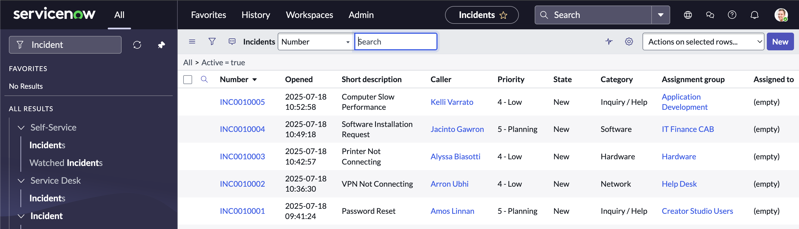

# ServiceNow Ticketing Simulation

This project simulates Tier 1 IT support ticket resolution using a ServiceNow Personal Developer Instance (PDI).

## 🧪 Project Overview
- Created and resolved mock incidents (password resets, VPN issues, printer setup, etc.)
- Used ServiceNow’s incident module to simulate real help desk workflows
- Tracked SLA metrics and documented resolution notes

## 🖼️ Screenshots

### Sample Ticket Creation

### Resolved Incident

### SLA Metrics

## 📄 Skills Used
- ITIL Concepts
- Ticketing Systems (ServiceNow)
- Troubleshooting Documentation
- SLA Compliance Awareness
